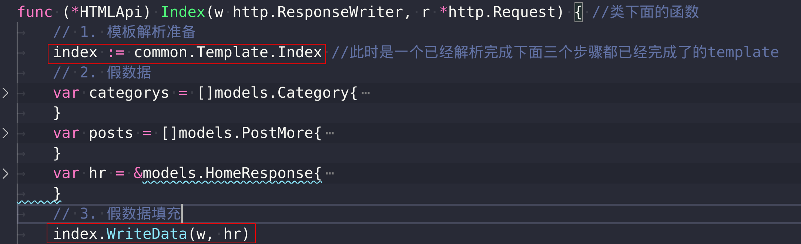
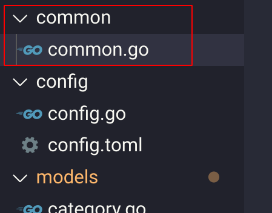

[toc]


# 一、提出问题


> **问题**：
>
> index.html页面的解析有一大块代码(这个html页面嵌套了很多别的页面)，然而我们有多个html页面，并且解析过程类似。因此我们可以将这些步骤抽离。
>
> 
>
> **本节我们想要做的事情**：
>
> - 将所有需要的html页面加载好， 在需要处理某个页面时就只需要填充真数据(`t.Excute(w,data)`)即可。
>
>   其中，加载过程包含了1. 获取路径、需要的函数填充、页面解析
>
> 
>
> 最后在路由函数中：
>
> ```go
> index := common.Template.Index //此时是一个已经解析完成下面三个步骤都已经完成了的template
> index.WriteData(w, data)
> ```


**下面是想要达到的效果**




# 二、实现

从想要达到的效果来看，我们需要实现两个函数

1. `模板解析func`：解析所有的模板html文件，以便路由函数需要做的事情只有填入数据
2. `数据填充func`


## 2.1 模板解析Func


首先给出

### **1. 使用**

在`main.go`中调用，在路由函数中使用模板解析函数


1. **初始化**：首先在`main.go`中直接初始化好所有的模板

```go
func init() {
	// 加载好所有template的html
	common.LoadTemplate()
}
```

2. **调用函数：**创建common文件，对于模板来说，作用是调用模板解析的函数

   

```go
// 通用文件
var Templates models.HtmlTemplate

// 加载所有模板文件
func LoadTemplate() {
	Templates = models.InitTemplate(config.Cfg.System.CurrentDir + "/template/")
}
```

3. **路由函数的使用用**

```go
func (*HTMLApi) Index(){
	// 1. 模板解析
	index := common.Templates.Index //已经处理好的index模板
	// 2. 假数据填充
	index.WriteData(w, hr)   
}
```


### 2. template解析模板

> 首先创建models/template.go 作用：处理模板


1. **准备所有模板的结构体**

​	要解析本项目所有的html template模板，需要创建一个结构体，以便路由函数使用

```go
// Template结构体：为了之后扩充更多的属性方法等
type TemplateBlog struct { //匿名内嵌结构体的写法
	*template.Template
}

// 所有模板的集合
type HtmlTemplate struct {
	Category   TemplateBlog
	Custom     TemplateBlog
	Detail     TemplateBlog
	Home       TemplateBlog
	Index      TemplateBlog
	Login      TemplateBlog
	Pigeonhole TemplateBlog
	Writing    TemplateBlog
}
```


2. `InitTempalte`解析模板的函数 
   - 返回一个所有模板解析完成的结构体
   - 传入1. 项目当前路径以便寻找html模板文件位置； 2. 所有模板对应的文件名

```go
// 解析所有html为template并返回
// 分为三个步骤：0.为html创建承接的模板 1.获取当前html路径 2.额外函数填充
// 3.解析模板以及涉及的html 4.数据填入
// Input:1. 当前路径
// Output:全部已经加载好的模板
func InitTemplate(curDir string) (HtmlTemplate, error) {
	tbs, err := readTemplate( //传入的文件名需要小写：与在服务器中存储的文件名相同，为了后面需要路径处理
		[]string{"category", "custom", "detail", "home", "index", "login", "pigeonhole", "writing"},
		curDir,
	)
	var htmlTemplate HtmlTemplate
	if err != nil {
		return htmlTemplate, err
	}
	// 返回HtmlTemplate
	htmlTemplate = HtmlTemplate{
		tbs[0], tbs[1], tbs[2], tbs[3], tbs[4], tbs[5], tbs[6], tbs[7],
	}
	return htmlTemplate, err
}
```


3. **解析模板核心函数`readTemplate`**

   3.1 上面InitTemplate只是在传入需要解析的模板并集合后返回， 核心处理函数是readTemplate()

   3.2 为什么要抽离出来？

   - 方便后面还要解析更多的模板
   - 该函数返回的是解析完成的模板数组，后面添加模板只需要修改前面的结构体，完全不需要修改本核心函数

```go
// 处理模板
// Input：要处理的模板名数组; 当前文件路径
// Output：处理好的模板数组; 解析模板错误
// Q：为什么要单独拧出来：以防后面再添加新的模板页，只需要精准的修改本func即可
func readTemplate(viewNames []string, curDir string) ([]TemplateBlog, error) {
	var tbs []TemplateBlog //返回
	home := curDir + "home.html"
	header := curDir + "layout/header.html"
	footer := curDir + "layout/footer.html"
	personal := curDir + "layout/personal.html"
	post := curDir + "layout/post-list.html"
	pagination := curDir + "layout/pagination.html"
	for _, v := range viewNames {
		viewName := v + ".html"
		t := template.New(viewName)
		// 2. 需要的函数填充
		t.Funcs(template.FuncMap{"isODD": IsODD, "getNextName": GetNextName, "date": Date, "dateDay": DateDay}) //传入函数
		// 3. 同时解析多个html文件
		t, err := t.ParseFiles(curDir+viewName, home, header, footer, pagination, personal, post)
		if err != nil {
			log.Println("解析模板出错：", err)
			return nil, err
		}
		var templateBlog TemplateBlog
		templateBlog.Template = t
		tbs = append(tbs, templateBlog)
	}
	return tbs, nil
}
```


在Index路由中，写入模板真数据的过程变为：
```go
index := common.Template.Index //此时是一个已经解析完成下面三个步骤都已经完成了的template
index.WriteData(w, data)
```

