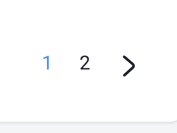

# 获取文章的分页

> 获取文章一共有多少的分页



需要下面几个信息：total、pages、pageEnd

1. total是总的文章条数

2. pages查询分页总页数（数据库中有15条数据，就要查询出总页数是2页（每页默认的10条设置的））

   计算方法： pages = (total - 1) / 10 +1

   比如共11条数据就是 2页  9条数据就是1页

3. pageEnd 当前page是否为最后一页，是就true。当到达最后一页时，就不会展示右箭头（下翻页键）


## 首页获取页数servce.Index

```go
//3. 定义数据结构来填充页面上的内容

	total, _ := dao.GetCountAllPost() //文章总数量
	pageCount := (total-1)/10 + 1
	pages := []int{}
	for i := 0; i < pageCount; i++ {
		pages = append(pages, i+1)
	}
	var hr = &models.HomeResponse{
		Viewer:    config.Cfg.Viewer,
		Categorys: categorys,
		Posts:     postMores,
		Total:     total, //文章总数量
		Page:      page,
		Pages:     pages, // 一共有多少页
		PageEnd:   page != pageCount,
    }
```


## 获取文章条数GetCount


**Count()聚合函数**

count(1)固定数提高效率，但都是计算符合条件的条目有多少条

下面两个都是返回student表里有多少条数据

```sql
select count(1) from student ;
select count(*) from student ;
```

[ select count(1) count中的1 到底是什么意思呢?和count(*)的区别](https://www.cnblogs.com/liuys635/p/11935952.html)

[廖雪峰](https://www.liaoxuefeng.com/wiki/1177760294764384/1179611448454560)


**函数**

```go
// 获取数据库中所有文章的数量
func GetCountAllPost() (count int, err error) {
	row := DB.QueryRow("select count(1) from blog_post")
	err = row.Scan(&count)
	return
}
```

