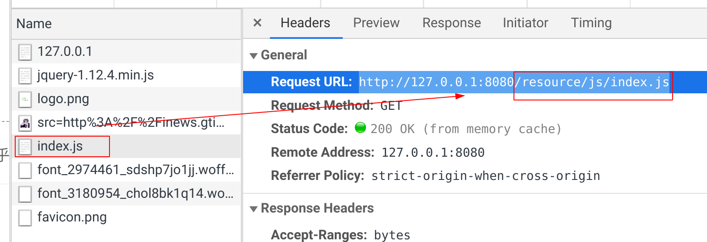
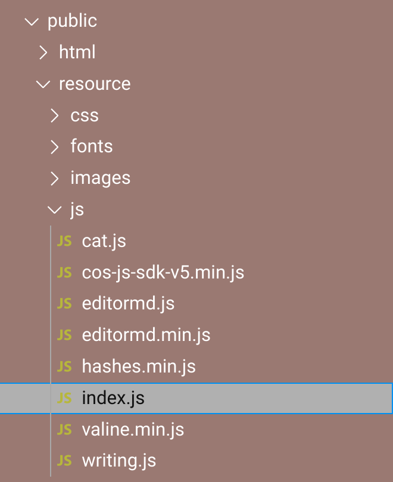

# 一、静态资源加载

### 0、前提

- 动态资源：网站显示的动态数据，如：一篇博文的内容、作者、今天的时间等等这些都会变化
- 静态资源：网站不会变的页面样式渲染


### 1、 发现问题

**问题**：页面获取到所有动态资源，但页面样式混乱

**原因**：静态的样式资源加载出错（css,js文件没有加载出来）。下面看看是怎么回事？

**index.html文件**中显示静态资源文件的请求路径是`/resource/js/index.js`。

```html
  </body>
  <script src="/resource/js/index.js"></script> <!--静态资源请求的路径-->
</html>
```

从加载页面时浏览器可看到index.js请求的资源路径如下：



但在 `main.go`中我们只注册了一个路由 `http.HandleFunc("/", index)` ， 这样所有请求都要走`/`路径，然后通过`index路由`处理。（`/resource/...`也会通过index路由 ）


### 2、 静态资源加载

因此，想要让请求 `/resource/js/index.js`请求到服务器的正确资源`index.js`位置，我们需要注册一个新的路由：进行静态资源的配置

```go
http.Handle("/resource/", 
            http.StripPrefix("/resource/", http.FileServer(http.Dir("public/resource/"))))
```

需要请求的 `index.js`路径如下： 

1. 客户端请求URL `/resource/js/index.js`，进入处理路由handler `http.StripPrefix(...)`
2. `http.StripPrefix`将URL过滤掉前缀 `/resource/` 剩下`js/index.js`
3. 在`http.FileServer(...)`给出的静态资源根目录public/resource/下面寻找
4. 此时寻找的静态的资源路径为 `public/resource/js/index.js` 


# 二、`http.StripPrefix`


#### `http.StripPrefix`的作用：

```go
func http.StripPrefix(prefix string, h http.Handler) http.Handler
```

在请求处理之前，将指定的prefix过滤出去。

比如，客户端请求的资源路径：

```go
/static/index.html
```

`http.StripPrefix("/static/", h http.Handler)`会将/static/去掉，请求的资源路径被修改为`index.html`， 这将会从http.File()返回的Handler的静态资源目录下去查找 `index.html`


#### 根据需要定制访问路径：

下面例子：

```go
http.Handle("/tmpfiles/",
        http.StripPrefix("/tmpfiles/", http.FileServer(http.Dir("/tmp"))))
```


`http.FileServer`已经表明静态资源路径在`/tmp`根目录下面，但我们希望URL是 `/tmpfiles/`开头。

当客户端请求`/tmpfiles/index.css`时，我们希望将`index.css`文件发送给客户端。

为了达到上述目的，我们需要从请求的URL去掉 `/tmpfiles/`前缀，而去掉后剩下的路径是相对于`FileSever`给出的根目录的路径。也就是，去掉后在服务器中寻找的资源路径为`/tmp/index.css`


