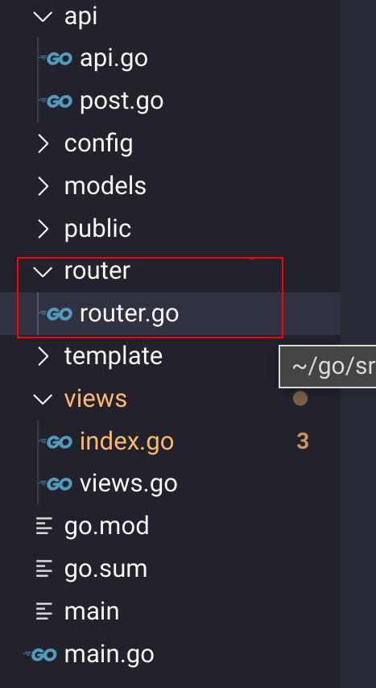
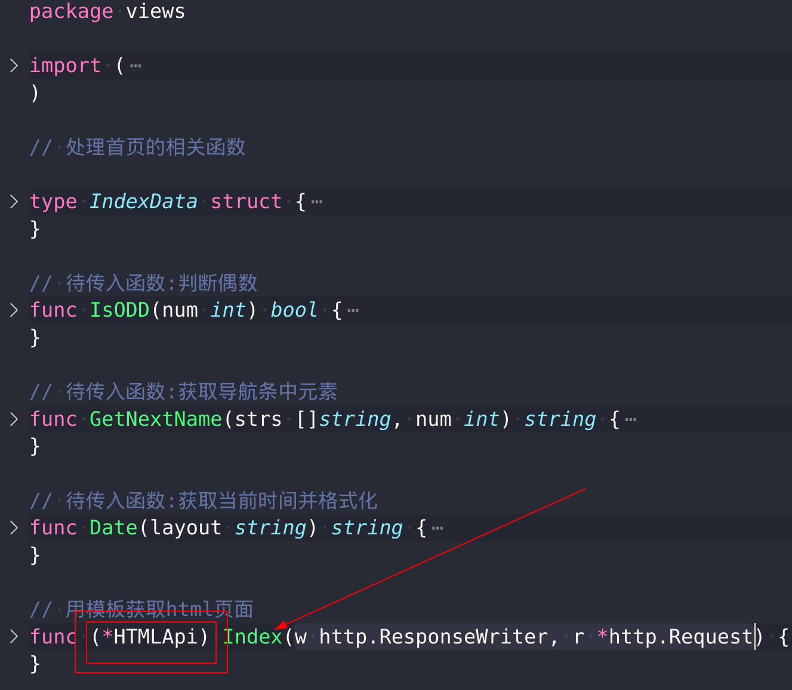
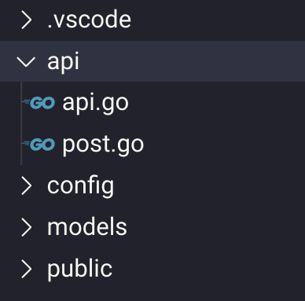

为什么要改造？

> `main.go`中包含了所有的路由处理函数，如 `func Index`、注册路由等等，看起来冗余
>
> 我们将Router相关的内容全部放到一个模块的文件夹下面


# 路由

1. **路由建立一个模块**：

   将路由相关的注册路由函数单独建立一个模块 ： 创建router.文件夹

2. **路由区分**：页面、数据(json)、静态资源


## 一、创建Router模块

1. 将所有路由注册函数集合到一起，创建Router文件夹



2. 为注册路由创建function

   ```go
   // 将路由集合起来
   func Router() {
   	// 页面：主页index路由
   	http.HandleFunc("/", views.HTML.Index)
   	// 数据：文章post路由
   	http.HandleFunc("/api/v1/post", api.API.Post)
   	// 静态资源不能让他走index这个路由，下面我们需要重新创建一个属于静态资源的路由
   	http.Handle("/resource/", http.StripPrefix("/resource/", http.FileServer(http.Dir("public/resource/"))))
   }
   ```

3. main简洁

```go
import ("BRK-go-Blog/router"
        
func main() {
	....
	// 注册路由
	router.Router()
	....
}
```


## 二、不同路由区分

路由主要分为三种：

为了将三种不同类型的路由进行区分，将不同类型的路由处理函数交给专门的模块处理

1. Views 页面 ： 如Index路由，它解析页面，返回页面
2. api 数据 json
3. 静态数据 : 如css、js渲染


接下来将三个不同的模块创建文件：

### 2.1 页面类

#### **1. 创建views类对象**：

`views.go`


 `views.go`

创建一个views类，页面类型的路由function都通过它访问

```go
package views

//创建类对象
var HTML = &HTMLApi{} //*HTMLApi function中是指针类型的类对象， 因此这里创建也需要创建指针类型

 //类
type HTMLApi struct {
}
```


#### **2. 页面路由function**

页面处理相关的函数同样在views文件夹下，每个页面单独建立一个 `.go`文件

比如，`index.go`包含了 :首页处理函数`Index(...)` 、为首页提供数据的一些函数




**路由函数需要与类建立联系**

```go
func (*HTMLApi) Index(w http.ResponseWriter, r *http.Request)
```


#### 3. 注册路由

在注册路由时，Handler的访问:

通过**模块.类对象名.路由函**数获得 ： `views.HTML.Index`

```go
http.HandleFunc("/", views.HTML.Index)
```


### 2.2 数据

实现与上面相同，下面



`api.go`

```go
package api

// 数据类型的路由对应模块
var API = &Api{}

type Api struct {
}
```

`post.go`

```go
package api

import "net/http"

// 处理请求文章相关内容
func (*Api) Post(w http.ResponseWriter, r *http.Request) {
}
```

